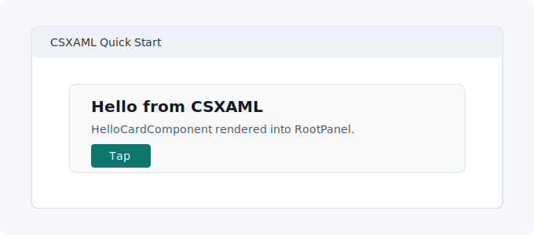

# Quick Start

This quick start assumes an existing WinUI app. By the end, the app window
will render a generated CSXAML component.

> [!IMPORTANT]
> Before you start, make sure the WinUI app already builds and launches without
> CSXAML. If you are starting from nothing, follow
> [Create a New App](create-new-app.md) first.

## 1. Install the package

Add the author-facing package:

```xml
<PackageReference Include="Csxaml" Version="0.1.0-preview.1" />
```

Keep the Windows App SDK package in the app project:

```xml
<PackageReference Include="Microsoft.WindowsAppSDK" Version="1.8.260209005" />
```

## 2. Add a component

Create `Components/HelloCard.csxaml`:

```csxaml
using Microsoft.UI.Xaml.Controls;

namespace MyApp.Components;

component Element HelloCard(string Title) {
    render <StackPanel Spacing={8}>
        <TextBlock Text={Title} />
        <Button Content="Tap" />
    </StackPanel>;
}
```

## 3. Add a host panel

In `MainWindow.xaml`, add a named panel that CSXAML can render into:

```xml
<Window
    x:Class="MyApp.MainWindow"
    xmlns="http://schemas.microsoft.com/winfx/2006/xaml/presentation"
    xmlns:x="http://schemas.microsoft.com/winfx/2006/xaml"
    Title="CSXAML Quick Start">
    <Grid Background="{ThemeResource ApplicationPageBackgroundThemeBrush}">
        <StackPanel
            x:Name="RootPanel"
            Margin="24" />
    </Grid>
</Window>
```

## 4. Render the component

In `MainWindow.xaml.cs`, create the generated component, set its typed props,
and render it through `CsxamlHost`:

```csharp
using Csxaml.Runtime;
using Microsoft.UI.Xaml;
using MyApp.Components;

namespace MyApp;

public sealed partial class MainWindow : Window
{
    private readonly CsxamlHost _host;

    public MainWindow()
    {
        InitializeComponent();

        var card = new HelloCardComponent();
        card.SetProps(new HelloCardProps("Hello from CSXAML"));

        _host = new CsxamlHost(RootPanel, card);
        _host.Render();
    }
}
```

`HelloCard.csxaml` generates two normal C# types:

- `HelloCardComponent`, the runtime component instance.
- `HelloCardProps`, the typed props record for `Title`.

## 5. Build

Build the project:

```powershell
dotnet build
```

The package-provided targets discover `.csxaml` files, run the packaged generator, and write generated C# under `obj\<configuration>\<tfm>\Csxaml\Generated\`.

## 6. Run

Run the WinUI app from Visual Studio or your normal project launch command.

Expected result: the app window shows a `StackPanel` with the title
`Hello from CSXAML` and a `Tap` button.



## 7. Common checks

If `HelloCardComponent` cannot be found, confirm the `.csxaml` file namespace
matches the `using MyApp.Components;` line.

If no generated files appear under `obj`, confirm the project references the
`Csxaml` package and the file extension is exactly `.csxaml`.

## 8. Next

Build the [Todo tutorial](../tutorials/todo-app.md) to learn state, props, events, child components, and testing.
