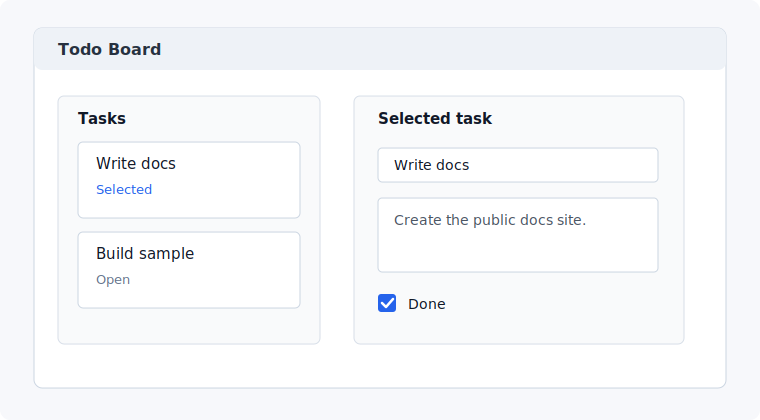

# Build a Todo App

This tutorial builds a small Todo board using the supported CSXAML v1 surface:

- components
- typed props
- component-local state
- native WinUI controls
- events
- keyed repeated children
- controlled `TextBox` and `CheckBox` inputs
- hostless component tests

The repo demo is the reference implementation for this tutorial:

- [`samples/Csxaml.TodoApp`](https://github.com/danielgary/csxaml/tree/develop/samples/Csxaml.TodoApp)
- [`TodoBoard.csxaml`](https://github.com/danielgary/csxaml/blob/develop/samples/Csxaml.TodoApp/Components/TodoBoard.csxaml)
- [`TodoCard.csxaml`](https://github.com/danielgary/csxaml/blob/develop/samples/Csxaml.TodoApp/Components/TodoCard.csxaml)
- [`TodoEditor.csxaml`](https://github.com/danielgary/csxaml/blob/develop/samples/Csxaml.TodoApp/Components/TodoEditor.csxaml)

You can copy the tutorial code into a new app that has the `Csxaml` package, or
compare it against `samples/Csxaml.TodoApp` when you want to see the repository's richer
demo implementation. The snippets below use `MyApp` namespaces so they can drop
into a new project.

Checkpoint map:

1. `TodoCard` compiles and shows title, status, select, and toggle actions.
2. `TodoEditor` compiles and exposes semantic automation IDs for tests.
3. `TodoBoard` renders two keyed cards and an editor.
4. Selecting a task updates the editor fields.
5. Editing the selected title updates the selected card.
6. A hostless test proves interaction, state update, and rerender.

## 1. Start with a WinUI project

Use a WinUI app or class library that meets the [prerequisites](../getting-started/prerequisites.md). Add the `Csxaml` package and keep `Microsoft.WindowsAppSDK` referenced by the app project.

## 2. Create a model

Use an immutable model so UI updates are explicit:

```csharp
namespace MyApp;

public sealed record TodoItemModel(
    string Id,
    string Title,
    string Notes,
    bool IsDone);
```

## 3. Add a card component

Create `TodoCard.csxaml`:

```csxaml
using Microsoft.UI.Xaml;
using Microsoft.UI.Xaml.Controls;

namespace MyApp.Components;

component Element TodoCard(
    string Title,
    bool IsDone,
    bool IsSelected,
    Action OnSelect,
    Action OnToggle) {
    render <Border BorderThickness={1} Padding={8} Margin={new Thickness(0, 0, 0, 8)}>
        <StackPanel Spacing={6}>
            <TextBlock Text={Title} />
            <TextBlock Text={IsDone ? "Done" : "Open"} />
            <Button Content={IsSelected ? "Selected" : "Select"} OnClick={OnSelect} />
            <Button Content="Toggle" OnClick={OnToggle} />
        </StackPanel>
    </Border>;
}
```

Typed props become a generated props record. Event props are ordinary C# delegates.

Checkpoint: after the board uses this component, each task will show its title,
status, select action, and toggle action.

## 4. Add an editor component

Create `TodoEditor.csxaml`:

```csxaml
using Microsoft.UI.Xaml.Automation;
using Microsoft.UI.Xaml.Controls;

namespace MyApp.Components;

component Element TodoEditor(
    string ItemId,
    string Title,
    string Notes,
    bool IsDone,
    Action<string, string> OnTitleChanged,
    Action<string, string> OnNotesChanged,
    Action<string, bool> OnDoneChanged) {
    render <StackPanel Spacing={8}>
        <TextBlock Text="Selected task" />
        <TextBox
            AutomationProperties.AutomationId="SelectedTodoTitle"
            Text={Title}
            OnTextChanged={value => OnTitleChanged(ItemId, value)} />
        <TextBox
            AutomationProperties.AutomationId="SelectedTodoNotes"
            Text={Notes}
            OnTextChanged={value => OnNotesChanged(ItemId, value)} />
        <CheckBox
            AutomationProperties.AutomationId="SelectedTodoDone"
            Content="Done"
            IsChecked={IsDone}
            OnCheckedChanged={value => OnDoneChanged(ItemId, value)} />
    </StackPanel>;
}
```

Controlled input is explicit: component code owns the value, and input events write the new value back.

Checkpoint: after the board uses this component, selecting a task should show
that task's title, notes, and done state in the editor. The automation IDs make
the same fields easy to query in tests.

## 5. Add the board state

Create `TodoBoard.csxaml`:

```csxaml
using Microsoft.UI.Xaml;
using Microsoft.UI.Xaml.Controls;
using MyApp;

namespace MyApp.Components;

component Element TodoBoard {
    State<List<TodoItemModel>> Items = new State<List<TodoItemModel>>(new()
    {
        new TodoItemModel("first", "Write docs", "Create the public docs site.", false),
        new TodoItemModel("second", "Build sample", "Keep the tutorial honest.", false)
    });

    State<string> SelectedItemId = new State<string>("first");

    TodoItemModel SelectedItem()
    {
        return Items.Value.Single(item => item.Id == SelectedItemId.Value);
    }

    void UpdateItem(string itemId, Func<TodoItemModel, TodoItemModel> update)
    {
        Items.Value = Items.Value
            .Select(item => item.Id == itemId ? update(item) : item)
            .ToList();
    }

    void SelectItem(string itemId)
    {
        SelectedItemId.Value = itemId;
    }

    void ToggleItem(string itemId)
    {
        UpdateItem(itemId, item => item with { IsDone = !item.IsDone });
    }

    var selected = SelectedItem();

    render <Grid RowDefinitions="Auto,*" ColumnDefinitions="320,*" Margin={12}>
        <TextBlock Grid.Row={0} Grid.ColumnSpan={2} Text="Todo Board" FontSize={24} />
        <ScrollViewer Grid.Row={1} Grid.Column={0}>
            <StackPanel Spacing={8}>
                foreach (var item in Items.Value) {
                    <TodoCard
                        Key={item.Id}
                        Title={item.Title}
                        IsDone={item.IsDone}
                        IsSelected={item.Id == SelectedItemId.Value}
                        OnSelect={() => SelectItem(item.Id)}
                        OnToggle={() => ToggleItem(item.Id)} />
                }
            </StackPanel>
        </ScrollViewer>
        <TodoEditor
            Grid.Row={1}
            Grid.Column={1}
            ItemId={selected.Id}
            Title={selected.Title}
            Notes={selected.Notes}
            IsDone={selected.IsDone}
            OnTitleChanged={(itemId, value) => UpdateItem(itemId, item => item with { Title = value })}
            OnNotesChanged={(itemId, value) => UpdateItem(itemId, item => item with { Notes = value })}
            OnDoneChanged={(itemId, value) => UpdateItem(itemId, item => item with { IsDone = value })} />
    </Grid>;
}
```

`State<T>` invalidates the component when `Value` changes. In-place collection mutation does not automatically rerender; assign a new value or call `Touch()` after a deliberate in-place update.

This tutorial intentionally renders a small visible task list with `foreach`.
That shape keeps the component easy to read and test, but it is not a
virtualized list. For large scrolling item surfaces, wrap a native virtualized
control and pass the data into that control instead.

Expected result: the app shows two task cards on the left and an editor on the
right. Selecting the second task updates the editor. Editing the title updates
the selected card.



Final layout:

```text
Todo Board
+----------------------+------------------------------+
| Task cards           | Selected task editor         |
| - Write docs         | Title TextBox                |
| - Build sample       | Notes TextBox                |
|                      | Done CheckBox                |
+----------------------+------------------------------+
```

## 6. Add keys to repeated children

The `Key` attribute tells the runtime which child identity should be retained across rerenders:

```csxaml
<TodoCard Key={item.Id} ... />
```

Use stable keys for repeated component children when the order can change or item state should be preserved.

## 7. Test the component

`Csxaml.Testing` provides hostless rendering helpers for runtime tests. A test can render the component, query the logical tree, and trigger interactions without inspecting generated code.

Typical test shape:

```csharp
using Csxaml.Testing;
using MyApp.Components;

using var render = CsxamlTestHost.Render<TodoBoardComponent>();

Assert.IsNotNull(render.FindByText("Write docs"));
Assert.IsNull(render.TryFindByText("Updated title"));

render.EnterText(render.FindByAutomationId("SelectedTodoTitle"), "Updated title");

Assert.IsNotNull(render.TryFindByText("Updated title"));
Assert.IsNull(render.TryFindByText("Write docs"));
```

This test proves that user-like interactions flow through component events,
update `State<T>`, rerender the logical tree, remove the previous title, and
expose the updated title.

Use semantic queries such as automation id, automation name, text, and content whenever possible.

## 8. What to read next

- [State and events](../language/state-and-events.md)
- [Native props and events](../guides/native-props-and-events.md)
- [Component testing](../guides/component-testing.md)
- [Runtime troubleshooting](../troubleshooting/runtime-behavior.md)
