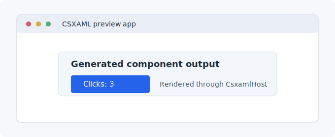

# CSXAML Documentation

CSXAML is an experimental source-generated language for building WinUI apps with XAML-like structure and real C# expressions.

Use it when you want component-shaped WinUI views where structure stays readable,
props and state are typed C#, and generated code remains inspectable.

```csxaml
using Microsoft.UI.Xaml.Controls;

namespace MyApp.Components;

component Element CounterButton(string Label, int Count, Action OnClick) {
    render <Button Content={$"{Label}: {Count}"} OnClick={OnClick} />;
}
```



The generated component is a normal C# type that renders through the CSXAML
runtime host or from another generated component.

## Start here

- [Quick Start](articles/getting-started/quick-start.md): install the package, render a first component, and see the app result.
- [Why CSXAML?](articles/getting-started/why-csxaml.md): compare CSXAML with XAML/code-behind and handwritten C# UI.
- [Todo tutorial](articles/tutorials/todo-app.md): learn props, state, events, native controls, and testing in one flow.
- [Language overview](articles/language/index.md): understand the component model before reading the full spec.
- [Editor extensions](articles/editors/index.md): set up VS Code or Visual Studio authoring.
- [API reference](articles/api/index.md): find runtime, testing, tooling, and metadata APIs.

## Common tasks

| Task | Start here |
| --- | --- |
| Install CSXAML | [Package Installation](articles/guides/package-installation.md) |
| Render the first component | [Quick Start](articles/getting-started/quick-start.md) |
| Debug a build failure | [Build and Generation Troubleshooting](articles/troubleshooting/build-and-generation.md) |
| Set up an editor | [Editor Extensions](articles/editors/index.md) |
| Test a component | [Component Testing](articles/guides/component-testing.md) |
| Check current support | [Supported Feature Matrix](articles/language/supported-features.md) |

## Current posture

CSXAML is still a preview technology. The [supported feature matrix](articles/language/supported-features.md)
separates supported v1 behavior from experimental and deferred areas so app
authors can build against the intended surface without relying on implementation
details.

The short version: components, props, local state, native control binding,
conditional/repeated markup, default slots, root hosting, testing helpers, and
the documented external-control slice are the supported path. Named slots,
virtualization, broad `DataContext` interop, and dedicated source-level
lifecycle syntax are intentionally outside the current v1 surface.
